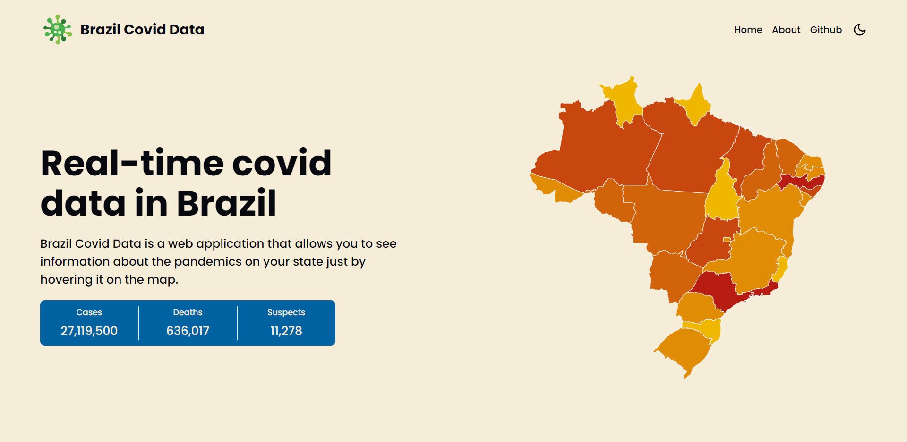
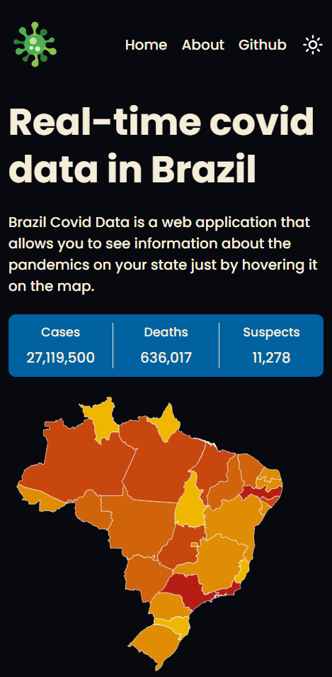

# Brazil Covid Data

## Índice

- [Sobre](#sobre)
- [Screenshots](#screenshots)
- [Links](#links)
- [Para desenvolvedores](#para-desenvolvedores)
  - [Rodando localmente](#rodando-localmente)
  - [Licença](#licença)
  
### Sobre

Página dedicada á divulgação e acompanhamento dos dados sobre a pandemia de Covid-19 no Brasil e em seus estados.

### Screenshots

<div>
  
  
</div>

<div>
  
  
</div>

### Links

Visualize a página através desse [link](https://whoiscaio.github.io/blogr-landing-page-main/).


## Para desenvolvedores

### Tecnologias

HTML - Linguagem de marcação para estruturação da página. <br />
CSS - Linguagem de estilização para definição de estilos aos elementos. <br />
Typescript - Linguagem de programação baseada em Javascript com tipagem. <br />
React - Framework Javascript para o desenvolvimento de UIs reativas. <br />
Context API - Biblioteca React para a manipulação de estados globais. <br />
Styled-Components - Biblioteca React para a criação de componentes estilizados. <br />

### Rodando localmente

Clone o projeto

```bash
  git clone https://github.com/whoiscaio/brazil-covid-data
```

Entre no diretório do projeto

```bash
  cd my-project
```

Instale as dependências

```bash
  npm install
```

Inicie o servidor

```bash
  npm run start
```

### Licença

[MIT](https://choosealicense.com/licenses/mit/)
