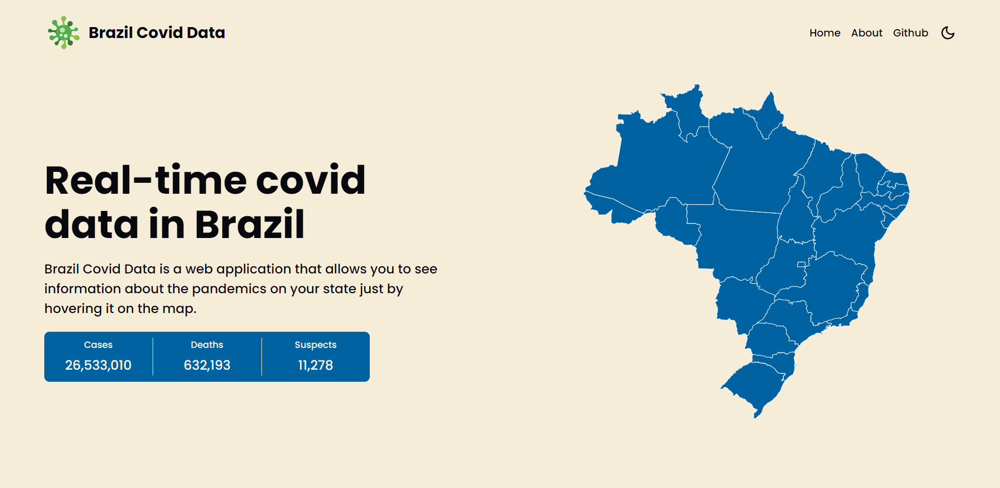
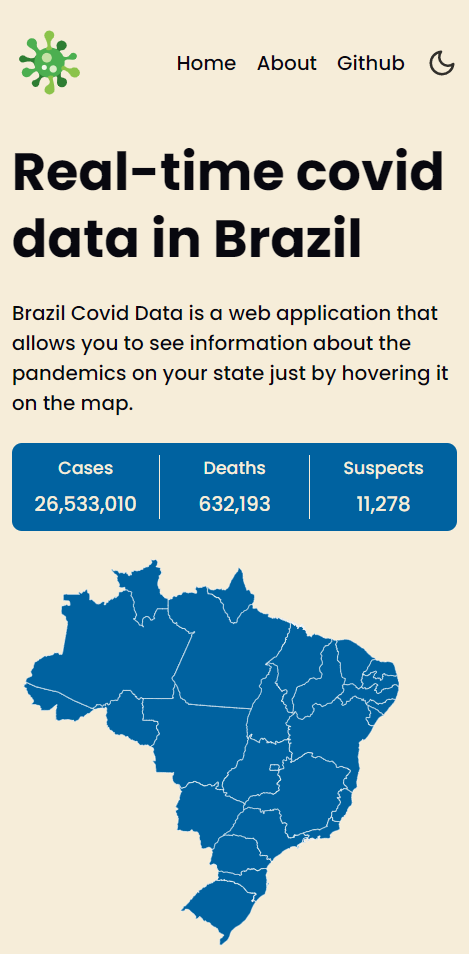
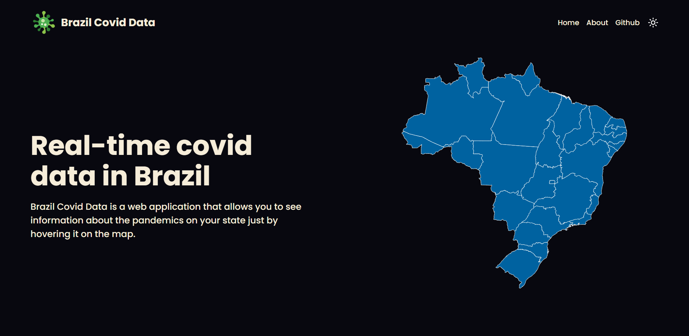
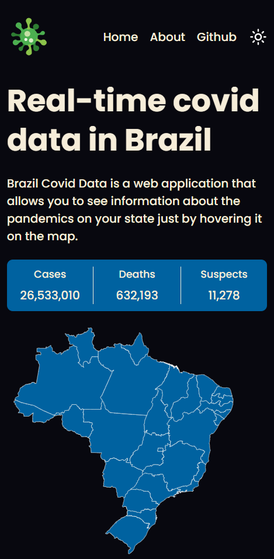

# Brazil Covid Data

Brazil Covid Data is a web application that allows you to see information about the pandemics on your state just by hovering it on the map.
## Screenshots

### Light Mode





### Dark Mode






## Setup

Go to the desired folder and run

```bash
  $ git clone https://github.com/whoiscaio/brazil-covid-data

  $ cd mycontacts-api
```

Then, install the packages and run the development server with:
(NPM)

```bash
  $ npm install

  $ npm run start
```

or: (YARN)

```bash
  $ yarn

  $ yarn start
```

And you're ready to go!


    
## Stack

**Front-end:** React, Typescript, Context API and Styled-Components.

**API:** [Covid-19 Brazil API](https://covid19-brazil-api.vercel.app/)


## Autor

- Github: [@whoiscaio](https://www.github.com/octokatherine)
- Linkedin: [Caio Lima](https://www.linkedin.com/in/lima-caio)

